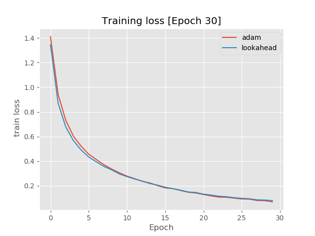
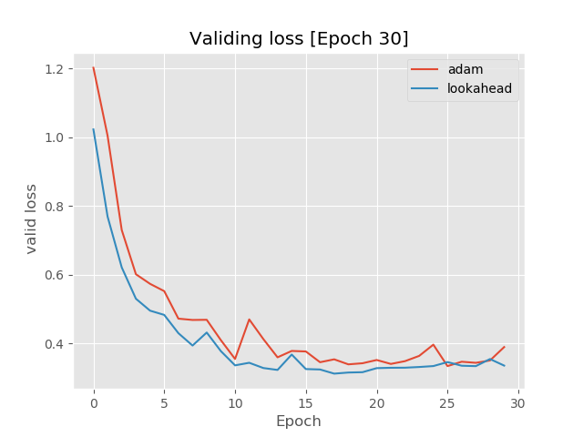
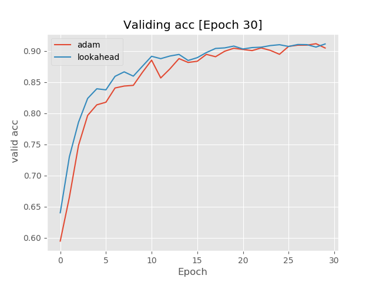

## Lookahead Pytorch

This repository contains a PyTorch implementation of the Lookahead Optimizer from the paper 

[Lookahead Optimizer: k steps forward, 1 step back](https://arxiv.org/abs/1907.08610)

by Michael R. Zhang, James Lucas, Geoffrey Hinton and Jimmy Ba.

## Dependencies

* PyTorch
* torchvision
* matplotlib

## Usage

The code in this repository implements both Lookahead and Adam training, with examples on the CIFAR-10 datasets.

To use Lookahead use the following command.

```python
from optimizer import Lookahead
optimizer = optim.Adam(model.parameters(), lr=0.001)
optimizer = Lookahead(optimizer=optimizer,k=5,alpha=0.5)
```

We found that evaluation performance is typically better using the slow weights. This can be done in PyTorch with something like this in your eval loop:
```python
if args.lookahead:
    optimizer._backup_and_load_cache()
    val_loss = eval_func(model)
    optimizer._clear_and_load_backup()
```
## Example

To produce th result,we use CIFAR-10 dataset for ResNet18.

```python
# use adam
python run.py --optimizer=adam

# use lookahead 
python run.py --optimizer=lookahead
```
## Results

Train loss of adam and lookahead with ResNet18 on CIFAR-10.



Valid loss of adam and lookahead with ResNet18 on CIFAR-10.



Valid accuracy of adam and lookahead with ResNet18 on CIFAR-10.


